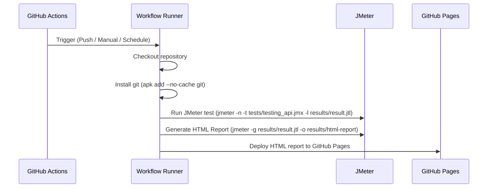

# ecommerce-qa

This project contains automated performance tests for the ecommerce platform using Apache JMeter and GitHub Actions.

## Description

- Automated load testing with JMeter.
- Generation and publication of HTML result reports.
- Continuous integration with GitHub Actions.
- Publishing reports to GitHub Pages.

This test a remote ecommerce api, which is part of the bigger ecommerce project.
It sends a 100 get requests to the API and measures the response time, throughput, and error rate and publishes the results in a report.

## View Results

You can view the latest test report at:

👉 [JMeter Test Report](https://felipebarretob.github.io/ecommerce-qa/)

## JMeter Workflow Pipeline

---